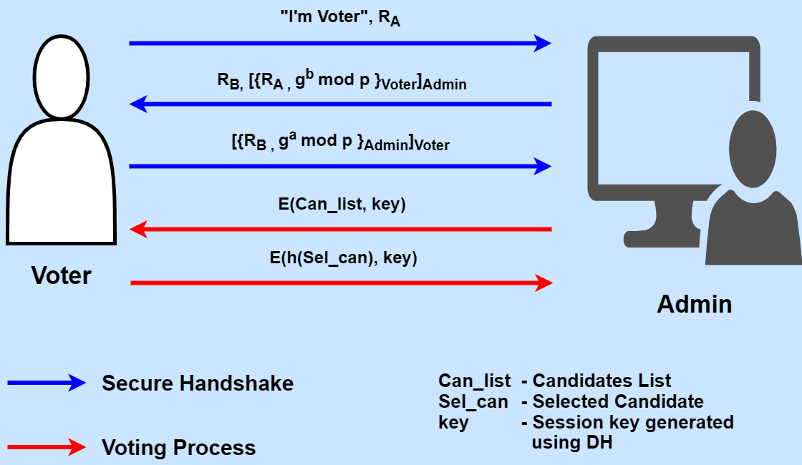

# Secure Voting System

This project is a Java-based implementation of a secure electronic voting system. It uses cryptographic techniques to ensure the integrity, confidentiality, and authenticity of votes. The system simulates the interaction between an administrator and multiple voters, from registration to vote tallying, all while protecting the communication with a secure session established using a Diffie-Hellman-like key exchange mechanism.

## Features

- **Voter Registration:** The administrator registers eligible voters.
- **Secure Handshake:** A secure session between the voter and the administrator is established using a custom Diffie-Hellman-like key exchange protocol.
- **Encrypted Communication:** All communication between the voter and the administrator, including the candidate list and the vote itself, is encrypted using the established session key.
- **Vote Integrity:** The system ensures that each voter can only vote once.
- **Vote Tallying:** The administrator can securely tally the votes at the end of the election.

## How to Run

1. **Prerequisites:**
   - Java Development Kit (JDK) 8 or higher.
   - An IDE like Eclipse or IntelliJ IDEA, or you can use the command line.

2. **Execution:**
   - Compile and run the `Main.java` file.
     ```bash
     javac src/voting_system/*.java
     java -cp src voting_system.Main
     ```
   - The output will show the secure handshake process for each voter, the encrypted communication, and the final vote tally.

## Cryptographic Protocol



The system employs a hybrid cryptographic protocol to ensure secure communication and voting. The protocol combines asymmetric (RSA) and symmetric (AES) encryption, along with digital signatures for authentication and a Diffie-Hellman-like key exchange for establishing a shared secret.

### Secure Handshake Protocol

The secure handshake protocol is as follows:

1.  **Voter -> Admin (Initiation):**
    - The `Voter` generates a random nonce, `RA`, and sends it to the `Admin`.

2.  **Admin -> Voter (Challenge):**
    - The `Admin` generates its own random nonce, `RB`, and a Diffie-Hellman public value, `g^b mod p`.
    - The `Admin` creates a payload containing `RA` and `g^b mod p`.
    - This payload is encrypted with the `Voter`'s public RSA key.
    - The encrypted payload is then signed with the `Admin`'s private RSA key.
    - The `Admin` sends `RB`, the encrypted payload, and the signature to the `Voter`.

3.  **Voter -> Admin (Response):**
    - The `Voter` first verifies the `Admin`'s signature on the encrypted payload using the `Admin`'s public RSA key.
    - The `Voter` then decrypts the payload with its private RSA key to retrieve `RA` and `g^b mod p`.
    - The `Voter` verifies that the received `RA` matches the one it sent.
    - The `Voter` calculates the shared secret: `Ks = (g^b)^a mod p`, where `a` is the `Voter`'s private Diffie-Hellman value. This shared secret is used to derive an AES session key.
    - The `Voter` creates a response payload containing `RB` and its own Diffie-Hellman public value, `g^a mod p`.
    - This response payload is encrypted with the `Admin`'s public RSA key and signed with the `Voter`'s private RSA key.
    - The `Voter` sends the encrypted response and signature to the `Admin`.

4.  **Admin (Finalization):**
    - The `Admin` verifies the `Voter`'s signature and decrypts the response payload.
    - The `Admin` verifies that the received `RB` matches the one it sent.
    - The `Admin` calculates the same shared secret: `Ks = (g^a)^b mod p`.
    - A secure session is now established.

### Voting Process

1.  **Candidate List:** The `Admin` sends the list of candidates to the `Voter`, encrypted with the AES session key.
2.  **Vote Casting:** The `Voter` decrypts the candidate list, selects a candidate, hashes the selection using SHA-256, and encrypts the hash with the AES session key. The encrypted hash is sent to the `Admin`.
3.  **Vote Storage:** The `Admin` decrypts the vote and stores the hash in a ledger.
4.  **Tallying:** The `Admin` tallies the votes by counting the occurrences of each candidate's hash in the ledger.

## Security Considerations

- **Confidentiality:** Votes are encrypted with AES, ensuring that only the `Admin` can see them. The handshake is protected by RSA.
- **Integrity:** Digital signatures are used during the handshake to ensure that messages are not tampered with.
- **Authentication:** The use of RSA key pairs ensures that the `Voter` and `Admin` are who they claim to be.
- **Replay Attack Prevention:** The use of nonces (`RA` and `RB`) ensures that an attacker cannot reuse old messages.
- **Forward Secrecy:** The use of a new Diffie-Hellman key pair for each session ensures that even if a long-term key is compromised, past session keys remain secure.

## Project Structure

```
.
├── bin
├── src
│   └── voting_system
│       ├── Admin.java
│       ├── CryptoUtil.java
│       ├── Main.java
│       └── Voter.java
├── .classpath
├── .gitignore
└── .project
